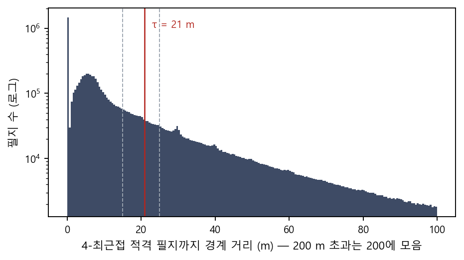
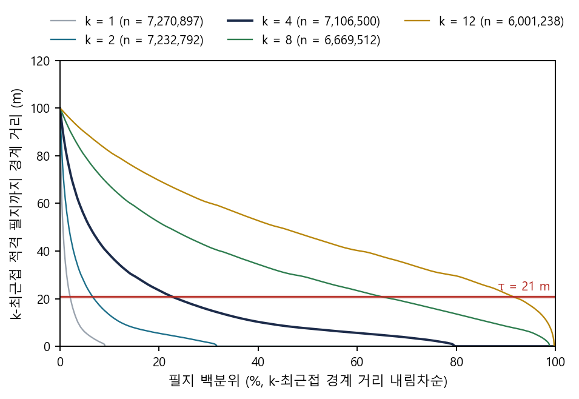
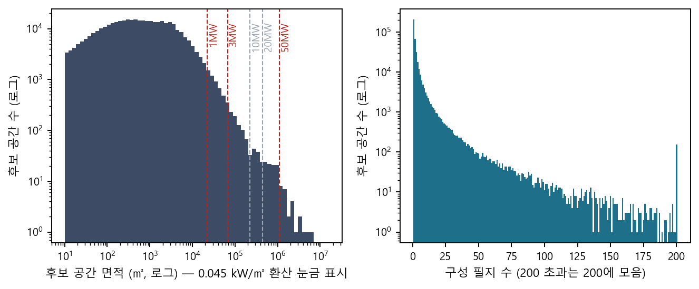
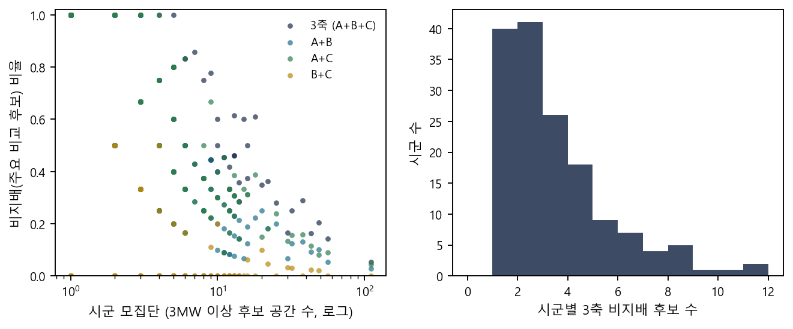
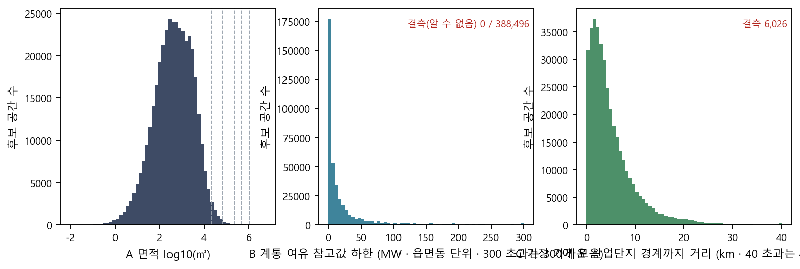
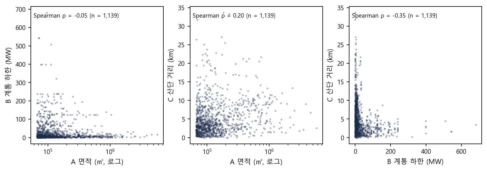
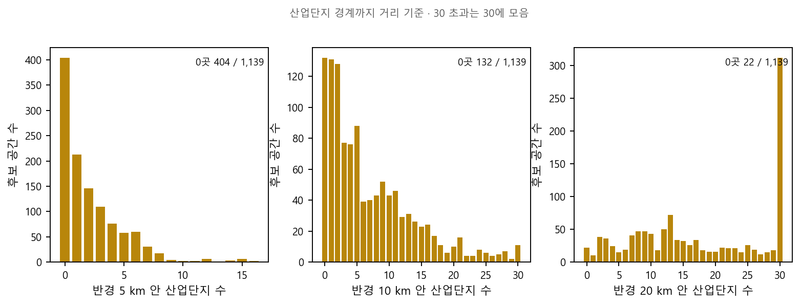
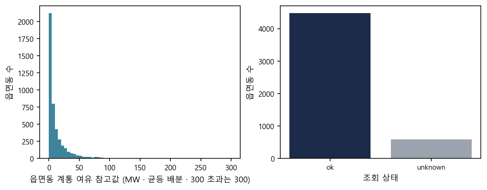

# 영농형 태양광 후보 공간 — 클러스터링 방법론 자문 자료 (공간 단위 · 클러스터 정의 · 우선순위 비교)

작성 2026-10-07 · PLANiT · 한국환경연구원(KEI) 서면 자문 자료 · 저장소 `sojin-droid/Agrivoltaic-Feasibility-V5`

**검토 범위** — ① 판정을 통과한 필지를 경계 간 거리 21m 이내 연접으로 묶은 단위를 최소 공간 분석 단위로 쓰는 것의 타당성 ② 그 위에 최종 클러스터(사업 단위) 층을 둘 필요성과, 둔다면 임의 기준값 없이 정의하는 원리 ③ 무가중 비지배 집합으로 우선 후보를 제시하는 방법과 보완 방안.
**검토 범위 밖** — 자료의 정확성·최신성(별도 데이터 검토) · 결측값 처리(데이터 보완 과제) · 법적 인허가 · 계통 접속 보장 · 경제성.
자문 결과를 받기 전에는 방법론과 데이터를 변경하지 않는다. 최종 클러스터 정의는 미정이다.

---

## 0. 수치 구분

- **정본 수치** — 사이트와 보고서가 인용하는 값(설치 가능 면적 1,038.85 km² · 50MW 이상 후보 공간 25곳 · 21m 연접 단위 388,121곳 등).
- **기술 통계** — 이 문서의 분포 그림·표를 위해 정본 산출로부터 계산한 요약값. 인용 수치가 아니다. 그림 원본 수치는 `docs/method_advisory/data/*.csv`, 생성 코드는 `docs/method_advisory/make_figures.py`.
- 화면판 `cluster_advisory.html` — 같은 내용을 탭으로 나눈 자문 화면. ③탭에 검토 대상지 10곳의 21m 단위 지도, ④탭에 질문 M1–M9 입력과 JSON/CSV 내보내기. https://sojin-droid.github.io/Agrivoltaic-Feasibility-V5/cluster_advisory.html

## 1. 연구 개요

전국 지적 필지 전수(39,726,310필지)를 대상으로, 영농형태양광 특별법(2026-12-17 시행 예정) 시행 전·후에 영농형 태양광을 설치할 수 있는 농지를 필지 단위로 판정하고, 그 결과를 공간 단위로 묶어 지자체·주민이 활용할 수 있는 형태로 공개하는 연구다. 목적은 농업진흥지역에도 설치를 허용했을 때의 효과를 근거로 제시하는 것이다. 분석 대상은 법인·국공유 소유 농지이며 개인 소유 농지는 포함하지 않는다. 결과는 공개 사이트(위 URL)와 보고서·논문으로 발행한다.

판정 조건(필지마다 동일 규칙): 지목(전·답·과수원) · 구조·입지 제외(건축물·수역·산업단지·다른 법의 설치 금지 지역) · 경사 15 초과 제외 · 용도지역 3종 제외(개발제한구역·보전관리지역·보전녹지지역) · 농업진흥지역 여부(시나리오). 자세한 조건은 사이트 「근거와 방법」 3-3.

## 2. 공간 분석 절차

```
개별 필지(판정 통과)
   │  경계 간 최근접 거리 ≤ 21 m 이면 연결 (단일연결 절단 = 연결성분)
21m 연접 단위 = 후보 공간 (analysis_unit_v1)      ← 최소 공간 분석 단위 · 면적 하한 없음
   │  시군 안에서 3축(면적 · 계통 여유 참고값 · 산단 거리) 무가중 비지배 집합 → "주요 비교 후보"
시군 집계 · 규모 눈금(1 / 3 / 10 / 20 / 50 MW 환산) · 화면 · 보고서
   │
최종 클러스터(사업 단위) 정의 — 미정
```

- **후보 공간**은 분석 단위이지 사업 단위나 특구가 아니다. 사이트·보고서에서 "클러스터"라는 말은 쓰지 않고 있다(§8 용어).
- 규모 눈금(1MW = 22,222㎡ · 3MW = 66,667㎡ · 50MW = 1,111,111㎡)은 0.045 kW/㎡로 환산한 **표시용 크기 구분**이며 판정·선별에 쓰지 않는다. 1MW 눈금은 마을 단위에서 운영되는 규모를 보기 위해 둔다. 면적 하한은 두지 않는다.

## 3. 연접 거리 산정

### 3-1. 임계의 성격

연접 거리 τ = 21m는 **선언 파라미터**다. 적격 필지 사이 간격의 분포에는 자연스러운 꺾임이나 골이 없어(3-3) 분포 자체가 특정 값을 가리키지 않는다. 21m는 간격을 만드는 지물의 종류와 폭(3-2)에 근거해 **구거·농로·소하천은 건너 묶고 폭 넓은 하천 본류·간선도로·철도는 끊는** 수준으로 20m 안팎 범위에서 정한 값이며, k-거리 곡선의 무릎은 이 범위를 확인하는 보조 근거다. 같은 논리는 15–25m 범위를 모두 허용하므로 15/21/25m 민감도(3-4)를 병기한다.

### 3-2. 간격의 구성과 지물 폭

**간격을 만드는 지물.** 비개인 소유 10MW 이상 구획(코어) 사이 간격이 21–50m인 쌍 197개의 틈에 끼인 필지 1,665개를 실측한 결과, 틈 면적의 59.6 %가 구거, 30.0 %가 도로였다(선형 구조물 합계 93.1 % · 소유는 국유지 90.5 %, 개인 0.6 %). 적격 농지 사이의 간격은 대부분 수로와 농로다.

| 지목 | 필지 | 틈 면적 | 면적 비중 |
|---|---|---|---|
| 구거 | 655 | 159.2 ha | 59.6 % |
| 도로 | 569 | 80.2 ha | 30.0 % |
| 지목 결측 | 138 | 11.2 ha | 4.2 % |
| 하천 | 9 | 5.9 ha | 2.2 % |
| 답 | 108 | 5.0 ha | 1.9 % |
| 제방 | 81 | 2.6 ha | 1.0 % |

원천: 분석보고서 `step4_5_buffer_derivation.md` §2-9(코어 간 간격 21–50m 쌍 197개 · 개입 필지 1,665개 · 코어·적격 필지 제외).

**지물 폭.** 간격을 만드는 지목의 폭(≈ 2 × 면적 ÷ 둘레)을 8개 시군구(당진·서산·김제·고흥·이천·구미·춘천·진주) 표본에서 실측했다. 구거·도로의 중앙값은 3–4m이고 25m를 넘는 것은 1 % 미만이다. 하천은 중앙값 6m이나 4.5 %가 25m를 넘는다(본류).

| 지목 | 표본 필지 | 폭 중앙값 | 10m 초과 | 25m 초과 |
|---|---|---|---|---|
| 하천 | 26,087 | 6.0 m | 24.9 % | 4.5 % |
| 철도용지 | 4,090 | 5.5 m | 26.6 % | 1.1 % |
| 제방 | 9,894 | 5.0 m | 12.0 % | 0.7 % |
| 구거 | 69,697 | 3.9 m | 5.0 % | 0.2 % |
| 도로 | 269,917 | 3.0 m | 7.3 % | 0.9 % |

원천: 분석보고서 `step4_1_distance.md` §7. 하천·철도용지는 지목이 농지가 아니므로 적격 필지가 아니며, 그 폭이 임계보다 넓으면 양쪽 농지가 자동으로 끊긴다.

**해석.** 임계를 20m 안팎으로 두면 구거(99.8 %)·도로(99.1 %)·소하천은 건너 묶이고, 폭 25m를 넘는 하천 본류(4.5 %)·간선도로·철도는 끊긴다. 임계를 10m로 낮추면 구거의 5 %·도로의 7 %·하천의 25 %가 끊겨 한 경작지가 수로 하나로 갈라지고, 50m로 높이면 하천 본류까지 대부분 건너 묶여 서로 다른 유역의 농지가 한 단위가 된다. 이 두 끝 사이에서 어느 값이 "사업 부지"의 경계 개념과 맞는지가 자문 문항 M2다.

### 3-3. 간격 분포와 k-거리 곡선 (보조 근거)

비접촉 적격 필지의 최근접 간격은 2–4m에서 최고점을 이룬 뒤 단조 감소하는 단봉 분포다(평활 후 추가 봉 0 · p50 7.0m · p75 18.5m · p90 38.9m). 4-최근접 거리의 누적 비율은 아래와 같다.

| 임계 | 누적 비율(≤) |
|---|---|
| 0 m (접촉) | 19.9 % |
| 10 m | 59.3 % |
| 15 m | 69.4 % |
| 21 m | 77.5 % |
| 25 m | 81.5 % |
| 50 m | 94.0 % |



그림 2. 4-최근접 경계 거리 히스토그램(0–200m, 로그 y). 점선 15·25m, 빨간 선 21m. 자연스러운 꺾임이나 골이 없다. (원천 `step4_1_gaps_S1.parquet`)

k-거리 곡선(각 필지에서 k번째로 가까운 적격 필지까지 경계 거리, 내림차순)에 Kneedle을 적용하면 무릎이 검출되지만, 그 위치는 **k에 비례해 이동**한다(k = 1 → 6m, 2 → 10m, 4 → 21.6m, 8 → 44m, 12 → 65m). 따라서 무릎 값은 자료가 가리키는 고유값이 아니라 k 선택의 함수다. k = 4(필지가 네 방향 이웃을 가진다는 격자 배열 가정)에서 S = 2–10 전 구간 20.0–21.6m가 나오며, 이 값이 3-2의 물리적 범위 안에 있다는 점에서 보조 근거로 쓴다.



그림 1. k = 1·2·4·8·12 k-거리 곡선(적격 필지 7,106,500개 기준, 내림차순). 빨간 선 = 21m, 음영 = k = 4의 S 2–10 무릎 대역. (원천 `step4_1_gaps_S1.parquet` · `step4_1_kneedle_S1.csv`)

| k | n | 무릎 (S = 2) | 무릎 백분위 | p25 | p50 | p75 | p95 |
|---|---|---|---|---|---|---|---|
| 1 | 7,270,897 | 6.0 m | 5.0 % | 0 | 0 | 0 | 6.0 |
| 2 | 7,232,792 | 10.0 m | 12.3 % | 0 | 0 | 3.6 | 26.4 |
| 4 | 7,106,500 | 21.6 m | 21.8 % | 2.5 | 7.5 | 18.9 | 54.3 |
| 8 | 6,669,512 | 44.4 m | 27.2 % | 16.1 | 28.9 | 46.6 | 79.9 |
| 12 | 6,001,238 | 65.2 m | 24.4 % | 31.6 | 46.2 | 64.6 | 89.8 |

### 3-4. 민감도 (τ = 15 / 21 / 25 m)

| τ | 21m 연접 단위 수 | 3MW 이상 | 50MW 이상 | 100MW 이상 | 설치 가능 면적 |
|---:|---:|---:|---:|---:|---:|
| 15 m | 432,271 | 1,087 | 15 | 3 | 1,038.85 km² |
| **21 m** | **388,121** | **1,119** | **25** | **8** | 1,038.85 km² |
| 25 m | 369,570 | 1,150 | 38 | 12 | 1,038.85 km² |

조건: 특별법 시행 후(농업진흥구역 설치 가능 · 농업보호구역 제외) · 법인·국공유. 15·25m 행은 2026-09-06 실행값(기하 회수 전). 병합은 면적을 보존하므로 **면적은 τ에 무관하고 단위의 수와 큰 단위의 개수만 달라진다**. 대규모(50MW 이상) 개수는 15 → 25 → 38로 τ에 민감하다. 관련 문항: M2 · M6.

## 4. 후보 공간 분포



그림 3. 왼쪽: 후보 공간 면적 분포(로그–로그, 환산 눈금 표시). 오른쪽: 구성 필지 수 분포. (원천 `scenario_runs/R2_promo/clusters.parquet`)

| 구분 | 단위 수 | 면적 합 | 면적 중앙값 | 구성 필지 수 중앙값 |
|---|---:|---:|---:|---:|
| 전체 | 388,121 | 1,038.85 km² | 462 ㎡ | 1 |
| 1MW 이상 (≥ 22,222 ㎡) | 5,648 | 413.78 km² | 35,876 ㎡ | 34 |
| 3MW 이상 (≥ 66,667 ㎡) | 1,119 | 254.44 km² | 109,186 ㎡ | 73 |
| 10MW 이상 | 244 | 161.19 km² | 447,196 ㎡ | 76.5 |
| 20MW 이상 | 122 | 123.09 km² | 743,747 ㎡ | 87 |
| 50MW 이상 | 25 | 54.44 km² | 1,611,404 ㎡ | 179 |

- 388,121곳 중 **1필지짜리 207,005곳(53 %)**. 면적 분위: p50 462㎡ · p90 5,093㎡ · p99 28,985㎡ · p99.9 142,689㎡.
- 파편화의 원인은 τ가 아니라 **소유 필터**다 — 개인 필지를 제외하면 법인·국공유 필지가 섬처럼 남는다(당진 사례: 548단위 중 61 %가 1필지). τ를 키워도 시군 전체가 400m부터 하나로 연쇄될 뿐 자연스러운 무릎이 없다.
- 면적 하한은 두지 않고 규모 눈금(3/10/20/50MW)으로 표시만 구분한다. 관련 문항: M1·M3.

## 5. 묶음 방법 비교

21m 연접(A)을 선행 연구에서 쓰는 다른 원리의 묶음 방법 세 가지(밀도 기반 HDBSCAN* · 그래프 커뮤니티 Leiden · 거리+면적 집적)와 같은 창(시군 필지 + 3 km)·같은 지표로 검토 대상지 10곳에서 비교했다. 방법마다 대표 파라미터 조합을 하나 또는 둘 적용했고, 결과는 10곳 중앙값과 시군별 값으로 제시한다. 채택 판정이 아닌 비교 기준선이다.

### 5-1. 비교 방법

| 계열 | 정의 | 자유 파라미터 | 결과 형태 · 특성(정의상 귀결) |
|---|---|---|---|
| **A** 21m 연접(현행) | 경계 거리 ≤ 21m 단일연결 → 연결성분이 곧 단위 | 1 (τ = 21m · 유도값) | 모든 필지가 정확히 한 단위에 속함 · 규칙을 한 문장으로 쓸 수 있음 |
| **B** HDBSCAN*(밀도) | 필지 경계 거리 · 상호 도달 거리 · condensed tree · 안정성 절단(필지 수 가중) | min_samples · min_cluster_size(시군별 유도) | 어디에도 속하지 않는 noise 필지가 생김(모든 적격 필지가 어딘가에 속한다는 규약과 충돌) · 큰 단위가 쪼개지기도 함 · 규칙이 시군마다 달라짐 |
| **C** Leiden 커뮤니티(그래프) | 21m 단위를 노드로 거리 가중 그래프 · 해상도 γ | λ · γ | 결과 단위가 "후보 부지"가 아니라 시군 여러 곳에 걸친 광역 권역 · γ 유도값이 지역마다 달라 단일 규칙이 서지 않음 |
| **D** 거리 + 면적 집적(씨앗) | 거리 g 안 이웃을 면적 목표에 닿을 때까지 붙임 | g · 목표 면적 | 목표 면적에서 닫히므로 "50MW 몇 곳"이 정의상 결과가 됨 · 목표 눈금 = 숨은 기준값(ADR-0041 위반) |

**평가 지표 5축 11지표**(가중 합 없이 지표별 우열만): 1 큰 공간 · 2 파편화 · 3 규모 · 4 행정 · 5 안정성 — 정의는 `METRICS_DEFINITIONS.md`.

### 5-2. 비교 결과

값은 **10곳 중앙값**(시군 관여 기준 · 창 밖으로 이어지는 클러스터는 창에서 잘림). 시군별 값은 `docs/method_advisory/data/method_comparison_sites.csv`, 실행 `model/proposals/pr0042/rerun_sites_20261007.py`. 

| 방법 | 파라미터 | 클러스터 수 | 1필지 비율 | <1MW 면적비 | <3MW 면적비 | ≥20MW 면적비 | 껍질 채움 | 1MW↑ | 3MW↑ | 10MW↑ | 50MW↑ | 체인 | 최대 km² | noise 필지(B) | 50MW 앵커 분할 |
|---|---|---|---|---|---|---|---|---|---|---|---|---|---|---|---|
| **A** 21m 연접 (현행) | τ=21m | 3,881 | 0.528 | 0.542 | 0.717 | 0.035 | 0.585 | 87 | 22 | 4 | 0 | 0.037 | 0.63 | 0 | 0 |
| **B** HDBSCAN* (밀도) | k=2, m=1.0×MCS (시군별 유도 99–404) | 4,650 | 0.995 | 0.227 | 0.227 | 0.546 | 0.038 | 26 | 26 | 16 | 3 | 0.155 | 2.27 | 10,752 | 0 |
| **C** Leiden 커뮤니티 (그래프) | λ=1000m, γ=0.5 | 48 | 0.626 | 0.001 | 0.003 | 0.974 | 0.026 | 16 | 15 | 14 | 8 | 0.199 | 4.60 | 0 | 0 |
| **C** Leiden 커뮤니티 (그래프) | λ=21m, γ=1.0 | 426 | 0.090 | 0.098 | 0.275 | 0.288 | 0.074 | 120 | 52 | 14 | 0 | 0.066 | 1.15 | 0 | 0 |
| **D** 거리+면적 집적 (씨앗) | g=200m, D2 목표 222,222㎡ | 809 | 0.358 | 0.133 | 0.251 | 0.032 | 0.148 | 122 | 64 | 28 | 0 | 0.038 | 0.63 | 0 | 0 |
| **D** 거리+면적 집적 (씨앗) | g=400m, D1 전량 병합 | 132 | 0.503 | 0.008 | 0.016 | 0.971 | 0.084 | 14 | 6 | 3 | 2 | 0.806 | 29.56 | 0 | 0 |

- **A**: 1필지 비율 약 0.5, 면적의 대부분이 3MW 미만 조각 — 작은 단위를 그대로 둔 결과. 자유 파라미터는 21m 하나.
- **B**: 밀도 기준이라 외딴 필지가 noise(어디에도 속하지 않음)가 되고 그 수가 많다. 큰 클러스터는 만들지만 "왜 같은 클러스터인가"를 거리로 설명할 수 없다.
- **C**: λ = 1,000m에서는 시군 전체가 수십 개 권역으로 묶여 50MW 이상이 여럿 생기지만 결과 단위가 "후보 부지"가 아니라 권역이다. λ = 21m는 A와 비슷한 자리.
- **D**: D2는 목표 면적(222,222㎡ ≈ 10MW)에서 닫히므로 10MW 이상 개수가 설계값에 따라 정해진다(숨은 문턱). D1은 거리 400m 전량 병합이라 한 덩어리로 연쇄한다.

관련 문항: M4 · M3.

## 6. 우선순위 비교 방법

### 6-1. 정의

- 비교 대상: 고른 시군 안에서, 고른 최소 규모 이상인 후보 공간 전부.
- 세 축: **A 면적**(㎡, 환산 MW 병기) · **B 계통 여유 참고값**(후보가 있는 읍면동의 분산전원 잔여 연계가능용량 하한, MW, 한전 2026-08-19 조회) · **C 산업단지 거리**(가장 가까운 산업단지 경계까지 직선거리, km).
- 기준 1개 → 그 축의 정렬 순위(TOP 10, 동률 동순위). 기준 2개 이상 → **비지배 집합**(고른 축 모두에서 같거나 낫고 한 축 이상에서 더 나은 후보가 하나라도 있으면 탈락). 집합 안에서 순위를 매기지 않는다. 동률은 지배가 아니다. 가중치를 곱해 한 점수로 합치지 않는다. 계통 값을 조회하지 못한 읍면동은 데이터 보완 과제로 다룬다.
- 가중치를 쓰지 않는 근거: 정준 다기준 방법 10종(SAW·TOPSIS·VIKOR·PROMETHEE II·WPM·Borda·Copeland·Maximin·GRA·DEA-CCR)을 원저 수식대로 144시군에 적용한 결과 **10방법 전부 지배 위반 0** — 어떤 방법·가중치의 1위도 비지배 집합 안에서만 나온다. 반면 점수법의 top-10 중 비지배 비율은 0.40–0.56에 그치고, 방법 간 순위 상관 τ는 0.26–0.999로 방법 선택만으로 순위가 크게 달라진다(PR-0036, 2026-09-06).

### 6-2. 이해관계자 의견

지자체·현장 관계자에게 "공동 1등(비지배 집합)" 제시 방식을 보여 준 결과: 집합 안의 순서(1·2·3위)에는 큰 의미를 두지 않았고, **자신이 고른 축을 중심으로 보든 모든 축을 다 보든 가중치 없이 비지배로 추리는 것이 전문가 설문으로 가중치를 만들어 순위를 매기던 방식보다 더 객관적**이라고 받아들였다. 관련 문항: M5.

### 6-3. 모집단 크기와 비지배 비율

비지배는 같은 모집단 안의 쌍별 비교이므로 **모집단이 작을수록 거의 전부가 남는다.** 후보가 1개뿐인 시군에서는 그 후보가 정의상 비지배다.



그림 8. 왼쪽: 시군 모집단(3MW 이상 후보 수) 대 비지배 비율(축 조합별). 오른쪽: 시군별 3축 비지배 후보 수 분포. (원천 `data_v4/top10/*.json.gz` 시행 후 조건 · 시군 touch 기준 1,139행)

| 모집단(3MW 이상) | 시군 수 | 후보 합 | 3축 비지배 합 | 비율(합산) | 비율(시군 중앙값) |
|---|---:|---:|---:|---:|---:|
| 1 | 26 | 26 | 26 | 1.00 | 1.00 |
| 2–4 | 58 | 159 | 117 | 0.74 | 0.75 |
| 5–9 | 37 | 236 | 127 | 0.54 | 0.50 |
| 10–19 | 23 | 292 | 121 | 0.41 | 0.40 |
| 20–49 | 8 | 259 | 63 | 0.24 | 0.27 |
| 50 이상 | 2 | 167 | 14 | 0.08 | 0.10 |

표기 규약(PR-0044 §15): 비지배 수는 항상 모집단 수와 함께 적고, 모집단 1개는 "단독(비교 대상 없음)"으로 배지를 쓰지 않는다. 관련 문항: M5.

## 7. 비교 축 자료 분포

아래는 3MW 이상 후보 공간(시군 touch 기준 1,139행, 시행 후 조건)과 그 입력 자료의 분포다. 축 추가·대체 검토의 참고 자료다.

### 7-1. 세 축 분포



그림 4. A 면적(로그) · B 계통 하한(MW, 읍면동 단위) · C 산단 거리(km). 정본 3축 표 전량(시군 touch 388,496행 · 면적 하한 없음 ). (원천 `block_context.parquet`)

| 축 | p5 | p25 | p50 | p75 | p95 | 비고 |
|---|---:|---:|---:|---:|---:|---|
| A 면적 ㎡ (전량) | 12 | 111 | 463 | 1,918 | 9,086 | 3MW(66,667㎡) 이상은 전체의 0.3 %(1,119곳) |
| B 계통 하한 MW | 0.0 | 1.4 | 6.4 | 21.4 | 102.4 | 읍면동 값이라 같은 읍면동 후보는 동일값 · 0 = 포화 |
| C 산단 거리 km | 0.40 | 1.83 | 3.72 | 6.85 | 14.99 | 산업단지 1,363곳(일반 763 · 농공 483 · 국가 65 · 도시첨단 52) 경계 기준 |

### 7-2. 축 간 상관 (3MW 이상)



그림 5. 쌍별 산점도와 Spearman 순위상관(n = 1,139).

| 쌍 | Spearman ρ | 읽기 |
|---|---:|---|
| 면적 – 계통 하한 | −0.05 | 거의 무관 |
| 면적 – 산단 거리 | +0.20 | 큰 후보일수록 산단에서 약간 멀다(간척지 효과) |
| 계통 하한 – 산단 거리 | −0.35 | 산단 가까운 곳의 계통 여유가 큰 경향 — 두 축이 부분적으로 겹침 |

관련 문항: M5(나).

### 7-3. 반경 내 산업단지 수



그림 6. 후보 공간 대표점에서 반경 5 / 10 / 20 km 안 산업단지 수(경계 기준). (좌표계 검증: 정본 최근접 거리와 재계산 차이 중앙값 0.003 km)

| 반경 | p25 | p50 | p75 | p95 | 0곳인 후보 |
|---:|---:|---:|---:|---:|---:|
| 5 km | 0 | 1 | 3 | 7 | 404 / 1,139 |
| 10 km | 2 | 5 | 11 | 21 | 132 / 1,139 |
| 20 km | 9 | 16 | 31 | 64 | 22 / 1,139 |

"가장 가까운 산단까지 거리" 대신 "반경 안 산단 수(또는 유형 가중 합)"를 쓰는 안은 화면의 보조 탐색 도구로만 있었고 정본 축으로 승격하지 않았다(반경이 또 하나의 자유 파라미터이기 때문이다). 현재 비교 축이 아니다. 관련 문항: M5(나).

### 7-4. 계통 참고값 분포



그림 7. 읍면동 계통 여유 참고값 분포(균등 배분 MW)와 조회 상태. (원천 DuckDB `grid_emd_v3`)

- 읍면동 5,066 중 조회 성공 4,477 · **알 수 없음 589**. 성공분 분위: p25 1.8 · p50 5.6 · p75 15.3 · p95 53.3 MW. 읍면동당 배전선로 중앙값 4.
- 조회 불가 읍면동(알 수 없음 589)은 데이터 보완 과제로 다루며, 검토 대상지는 알 수 없음 읍면동이 없는 시군으로 선정했다.
- 계통 값은 **읍면동 단위 참고값**이지 후보 공간의 접속 가능 용량이 아니다. 판정에는 쓰지 않는다.

## 8. 용어

| 표기 | 뜻 | 쓰지 않는 말 |
|---|---|---|
| 후보 공간 | 판정 통과 필지를 21m 이내 연접으로 묶은 최소 공간 분석 단위 | 클러스터 · 블록 · 구획(화면) |
| 최종 클러스터 | 사업 단위로서의 묶음 — **정의 미정** | — |
| 주요 비교 후보 | 고른 축의 비지배 집합(공동 1등) | 추천 · 1위 · 점수 |
| 규모 눈금 | 1 / 3 / 10 / 20 / 50 MW = 면적 × 0.045 kW/㎡ 환산 구분(표시용 · 1MW = 마을 단위 운영 규모) | 설치 용량 · 법정 기준 |
| 특구 | 법률 용어(재생에너지지구 등)에 한정 | 후보 공간의 별칭으로 사용 금지 |
| 단일연결 절단 | 거리 h에서 자른 단일연결 = 거리 h 그래프의 연결성분(학술적으로 정확) | regionalization(동질성 최적화를 하지 않으므로 부정확) |

표준 공간 단위와의 대조(필지·획지·가구·기초단위구·집계구)와 MAUP 논의는 `model/concepts/SPATIAL_UNITS.md`(요청 시 제공).

## 9. 자문 질문 (M1–M9)

자문 화면(`cluster_advisory.html`) ④ 탭에서 같은 번호로 답하고 JSON/CSV로 내려받아 보내 주시거나, 이 문서 번호를 붙여 서면으로 주셔도 된다. 화면에는 각 문항 아래에 참고 표를 두었다.

- **M1 최소 공간 분석 단위** — 판정을 통과한 필지를 경계 간 거리 21m 이내로 이어 묶은 단위(단일연결 절단 = 연결성분)를 최소 공간 분석 단위(후보 공간)로 쓰는 것이 타당한가. 도로·구거를 건너 묶는 설계가 사업 부지 개념과 맞는가. 면적 하한을 두지 않은 것은 적절한가.
- **M2 연접 거리 임계** — τ = 21m는 간격을 만드는 지물의 폭(구거·도로 중앙값 3–4m, 25m 초과 1 % 미만 · 하천 중앙값 6m, 25m 초과 4.5 %)에 근거해 "구거·농로·소하천은 건너 묶고 하천 본류·간선도로·철도는 끊는" 수준으로 20m 안팎에서 선언한 값이며, k-거리 곡선의 무릎(k = 4에서 20.0–21.6m)은 보조 근거다. 이 범위 설정과 선언 방식이 적절한가. 지물 폭 분포에서 임계를 직접 정하는 방식 등 더 나은 유도 방법이 있는가. 15·21·25m 민감도 제시는 충분한가. (§3)
- **M3 최종 클러스터 층** — 21m 단위 위에 사업 단위 층이 필요한가. 필요하다면 거리 임계·밀도·그래프 커뮤니티·목표 규모 집적 중 어떤 원리가 맞고, 임의 기준값(1,000m·목표 면적) 없이 정당화하는 방법은 무엇인가. (§5)
- **M4 "좋은 클러스터"를 재는 지표** — 대안 방법(밀도·커뮤니티·집적)과 비교할 때 쓴 5축 11지표(큰 공간 · 파편화 · 규모 · 행정 · 안정성 — §5, 정의 전문 `METRICS_DEFINITIONS.md`)가 좋은 클러스터를 판단하기에 충분한가. 빠진 지표(둘레 기반 응집도 · 도로·구거 관통 · 소유 혼합 · 환경 제약 겹침 · 농지 연속성 · 진입 도로 등)나 불필요한 지표가 있는가.
- **M5 후보 사이의 우선순위 비교** — 같은 시군 안의 후보를 세 축(면적 · 계통 여유 참고값 · 산단 거리)으로 비교해 어느 축에서도 뒤지지 않는 후보를 "주요 비교 후보(공동 1등)"로 보여 주고, 가중치로 한 줄로 세우지 않는다(§6). 참고: 이해관계자 반응(§6-2) · 축 간 상관(§7-2) · 반경 안 산단 수(§7-3) · 모집단 크기별 비지배 비율(§6-3).
  - (가) 공동 1등 제시 방식이 후보 비교 방법으로 적절한가.
  - (나) 추가·대체 축 의견 — 반경 안 산단 수 · 시군 전력판매량 대비 · 도로 접근성 · 환경 제약 거리 · 경작 현황 · 기존 시설 밀도 등.
  - (다) 동률과 비교 범위 — 세 축 값이 모두 같은 두 후보는 어느 쪽도 상대를 이기지 못하므로 둘 다 공동 1등으로 남긴다(계통 여유가 읍면동 단위 값이라 같은 읍면동 후보끼리 동률이 잦다). 비교는 같은 시군 안에서만 한다(후보를 검토하는 주체가 시군). 이 두 처리가 타당한가. 다르게 한다면(동률이면 면적 큰 쪽만 남김 · 시도 단위 비교 등) 어떻게.
- **M6 민감도 분석** — 결과를 바꿀 수 있는 설정값은 ① 연접 거리 21m ② k = 4 ③ 규모 눈금(1/3/10/20/50MW · 1MW는 마을 단위 운영 규모) ④ 소유 필터(법인·국공유만). 지금은 ①을 15/21/25m로 바꿔 본 표만 있다(§3-3). 보고서·논문에서 어느 값을 어느 범위로 움직여 보여 주면 독자가 결과를 신뢰할 수 있는가(연접 거리 ±5m / ±10m 이상 · k 2·4·8 · 규모 눈금 경계 · 1MW 눈금의 적절성 · 소유 필터 범위 · 축 정의 · 지금으로 충분). 표·그림·지도 중 어떤 방식이 좋은가.
- **M7 용어** — 자문 자료와 공개 사이트에서 쓰는 용어 19개(§8 표 + 판정 통과 필지 · 설치 가능 면적 · 면적당 환산 계수 · 계통 여유 참고값 · 산업단지 거리 · 특별법 시행 전/후 · 농업진흥지역이 아닌 농지 · 1필지 단위 · 기하 없음·품질 검토 · 간척 비중 · 경작 판독 비율 · 시군 관여 · k-거리 무릎)에 대해 각각 적합 여부(O/X)와 대안 표현.
- **M8 환경 제약을 다루는 단계** — 생태·경관·재해 등 다른 법령으로 설치가 막히는 지역은 지금 필지 판정 단계의 제외 조건(설치 금지 지역 17종 통합 표시 · 경사 15 초과)으로만 들어가 있고, 그 뒤 후보 공간을 묶거나 우선순위를 매길 때는 다시 쓰지 않는다. 이것으로 충분한가, 아니면 공간 단위 정의 단계(제약 구역을 건너서는 묶지 않음)나 우선순위 축(보호구역까지 거리)에도 반영해야 하는가.
- **M9 종합** — 가장 먼저 바꾸거나 보강할 것 하나, 그대로 두어도 되는 것.


## 10. 참고 자산

| 자산 | 위치 | 비고 |
|---|---|---|
| 공개 사이트 | https://sojin-droid.github.io/Agrivoltaic-Feasibility-V5/ | 「근거와 방법」 3-3(연접 기준) · 4(우선순위 비교 방법) |
| 자문 화면 | https://sojin-droid.github.io/Agrivoltaic-Feasibility-V5/cluster_advisory.html | 이 문서의 화면판 + 검토 대상지 10곳 21m 단위 지도 + 질문 M1–M9 입력·내보내기 |
| 이 문서의 그림·수치 | `docs/method_advisory/fig/` · `docs/method_advisory/data/` · `make_figures.py` | 기술 통계 |
| 검토 대상지 10곳 선정 기준 | `docs/method_advisory/STUDY_AREAS.md` · `study_areas.json` | 순위 선정이 아님 — 규모 프로파일 층 S1–S4 · 산단·계통 조합 · 지역이 고루 들어가도록 연구자가 고른 사례 · 결측 시군 제외 |
| 평가 지표 정의서 | `docs/method_advisory/METRICS_DEFINITIONS.md` | 방법 비교에 쓴 5축 11지표의 정의·계산식·입력 규격(계산 스크립트는 요청 시) |
| 대상지 데이터 패키지 | GitHub Release (링크는 발송 전 기재) | 시군별 필지·21m 단위(전량)·단위 쌍 거리·맥락 레이어·README |
| 비공개 문서(요청 시 발췌 제공) | ADR-0041/0055 · PR-0036 다기준 비교 · PR-0042 방법 비교 · `SPATIAL_UNITS.md` | 모델 저장소는 비공개 |

## 11. 수치 사용 기준

- 이 문서의 분포 그림·표는 기술 통계이며 보고서·논문 인용 수치가 아니다. 인용 수치는 정본 질의(`model/query.py`)와 시금석 검사를 거친 값만 쓴다.
- 정본 3축 표·폴리곤은 전량(면적 하한 없음) 기준이다.
- 계통·MW·산단 거리는 모두 참고값이며 판정·법적 효력·접속 보장과 무관하다.
